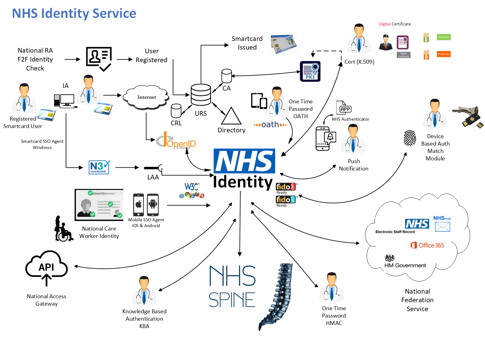

NHS Identity is a cloud-based solution that will provide digital identity and access management services to the national health and social care workers. Currently the only way to authenticate users is over an N3 (HSCN) connection using a Smartcard.  NHS Identity will be available over the internet which will enable access where an N3 connection is not available and open up use of services to a range of smaller organisations.

Additionally, the service will be available to authenticate with a range of alternative devices as well as Smartcards.  This will help users who are mobile as they will still be able to access clinical information at the point of need.

The system supports federation of identity – meaning that all the systems that use the national identity will be able to log in once (for all). NHS Identity will also cater for scale and simplify management with one central service to store authentication and access rules.

The primary objectives of NHS Identity are to provide:

> * A sufficient level of **assurance** that the user is who they say they are for the sensitivity of digital information they are accessing
> * A **trusted** secure token representing the user’s national digital identity in an industry recognised format
> * A **frictionless** sign-on process that aligns to the user working patterns, only asking for additional action when necessary. A single sign-on is the target
> * Support for **all** IT platforms and devices such as a PC, laptop, tablet, phone or wearable
> * Interaction with the service from **any** UK based location (N3 not required)
> * To be **available** 24x7, 365 days a year
> * To **abstract** identity & access into a cloud service that can be easily consumed by many client applications and services no matter what language they are written in and to shield those clients from any changes that happen in that service
> * **Protection** for national services ensuring the requester has **legitimate rights** to the resources requested
> * Facilitate flexible, easier ways for authentication by providing **alternatives** to Smartcards.

**Current Status:**
NHS Identity is currently being run as a **Beta** Service in the Live Environment.

Please click on the diagram below to see the various mechanisms offered by NHS Identity.
	