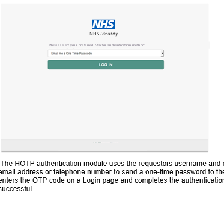
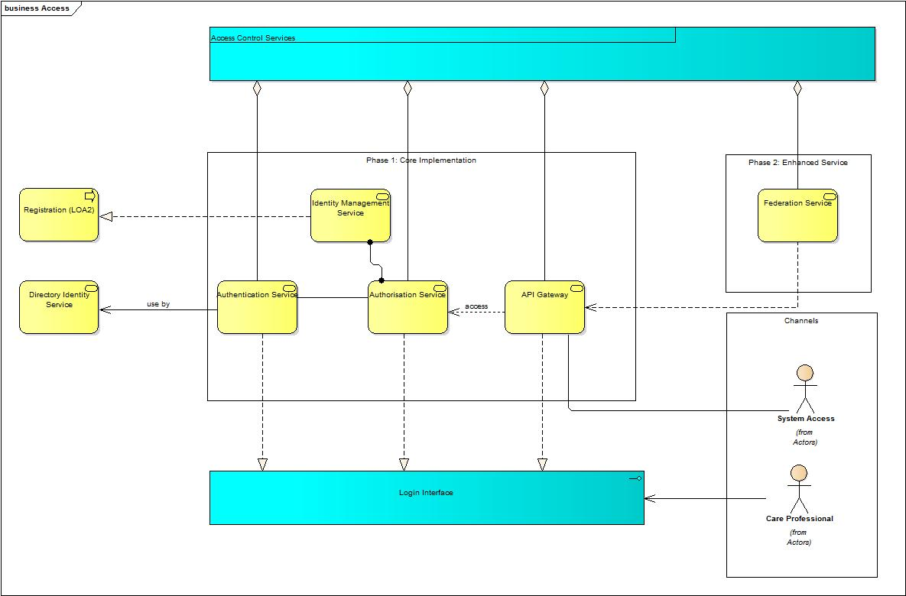

## Introduction

Digital identity is the online persona of a subject. In terms of the NHS Digital Care Access Service this will be the national identity for health and social care workers. 

A digtal identity that is provided as a separate cloud service is a powerful mechanism as it can be consumed many times (from a single logon), it can be linked with every day devices to provide extra contextual information about that user (e.g. location, nearby services) and it can profile the characteristics of the owner(usual times of sign-on, services normally used, location, devices usual used or linked to the user).

Adoption of such a cloud service from a nationally trusted provider such as NHS Digital facilitates cross organisational access without the need for costly middleware components that can tie one organisation to another. It also caters for scale and simplifies management with 1 central service to store authentication & access rules 

The primary objectives of this Care Access Service is to provide:
* A sufficient level of assurance that the user is who they say they are for the sensitivity of digital information they are accessing**
* A trusted secure token representing the users national digital identity in an industry recognised format
* A sign-on process that is as frictionless to the user as possible. Aligning to their working patterns and only asking for additional action when necessary.  A single sign-on is the target
* Support for all IT platforms and devices whether that be a PC, Laptop, Tablet, Phone or Wearable
* Interaction with the service from any UK based location (N3 not required)
* To be available 24x7, 365 days a year 
* To abstract identity & access into a cloud service that can be easily consumed by many client applications and services no matter what language they are written in and to shield those clients from any changes that happen in that service.
* Protection for national services ensuring the requestor has legimate rights to the resources requested.

In alignment with the goals of 2020 Paperless NHS it is the vision of the Access Improvements programme to: 

**“Enable care workers to have simple, secure and timely access to appropriate digital care service information, in any care setting at the point of need”**

### Overview of Care Access Services (CAS)

This is a PNG image 

The diagram below shows the main functional services offered by the new Care Access Service.

Care Access Service will deliver the following services for Care Professional as well as System (API) Access :

* Authentication Service
* Authorisation Service
* API Gateway Service
* Federation

The following sections will detail the remit of each of these services.
One time Password

HMAC One time Password

Push Notification Screen 1

Push Notification Screen 2

This is a 

### TW - Please review this section

These pages provide an introduction to NHS Digital's implementation of the OpenID Connect specifications.

An introduction to OpenID Connect and a detailed description of the Authorization Code Flow which is the basis of 
NHS Digital's implementation can be found [here](explore_intro_to_oidc.html).

An introduction to the NHS Digital implentation of and a detailed description of its online and 
offline modes of operation can be found [here](develop_intro_to_nhs_impl.html).
