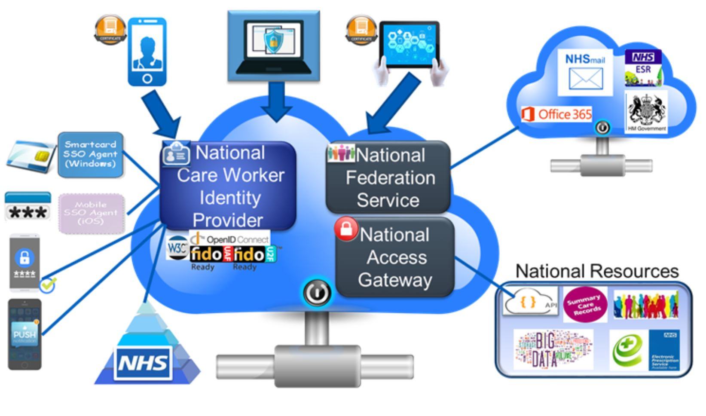

The diagram below shows an overview of the NHS IdentityService.

Digital identity is the online persona of a subject. In terms of the NHS Identity this will be the national identity for health and social care workers. 

A digital identity that is provided by a separate cloud service is a powerful mechanism as it can be consumed many times (from a single logon), it can be linked with every day devices to provide extra contextual information about that user (e.g. location, nearby services) and it can profile the characteristics of the owner(usual times of sign-on, services normally used, location, devices usual used or linked to the user).

Adoption of such a cloud service from a nationally trusted provider such as NHS Digital facilitates cross organisational access without the need for costly middleware components that can tie one organisation to another. It also caters for scale and simplifies management with 1 central service to store authentication & access rules 

The primary objectives of this NHS Identity Service is to provide:
> * A sufficient level of **assurance** that the user is who they say they are for the sensitivity of digital information they are accessing
> * A **trusted** secure token representing the users national digital identity in an industry recognised format
> * A sign-on process that is as frictionless to the user as possible. Aligning to their working patterns and only asking for additional action when necessary.  A single sign-on is the target
> * Support for all IT platforms and devices whether that be a PC, Laptop, Tablet, Phone or Wearable
> * Interaction with the service from any UK based location (N3 not required)
> * To be available 24x7, 365 days a year 
> * To abstract **identity & access into a cloud service** that can be easily consumed by many client applications and services no matter what language they are written in and to shield those clients from any changes that happen in that service.
> * **Protection** for national services ensuring the requestor has **legimate rights** to the resources requested.

 
